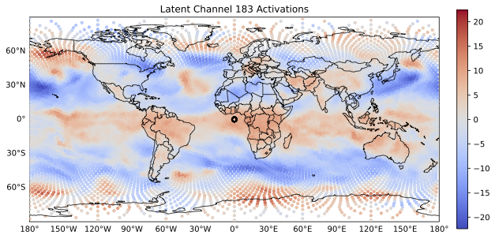

# AI Weather Model Latent Space Visualiser

## Overview



*Example latent activation map showing spatial structure of a selected channel from Graphcast small.*

This repository contains a Streamlit application for exploring the latent space of AI-based weather models. The app enables interactive analysis of latent features, spatial patterns, and their relationship to physical variables. It currently supports Graphcast model configurations and is created in a way to allow for easy adaption.

***The aim of this tool is to be able to simply carry out first analysis of the latent space, and to inspire research in this area***. 

The workflow includes:

1. Selecting a model and forecast time
2. Selecting a geographic region
3. Extracting latent representations
4. Performing cosine similarity analysis
5. Performing principal component analysis (PCA)

This code accompanies the results presented in the associated research paper.

---
## Requirements

- Python >= 3.12
- pip (latest recommended)

## Installation

Clone the repository:

```bash
git clone https://github.com/ktempestuous/latent_space_visualiser_weather_models.git
cd latent_space_visualiser_weather_models
```

Create a virtual environment (recommended):

```bash
python -m venv venv
source venv/bin/activate  # Linux / Mac
venv\Scripts\activate     # Windows
```

Install dependencies:

```bash
pip install -r requirements.txt
```

---

## Running the App

```bash
streamlit run app.py
```

The app will open in your browser.

In the case you are running the app on Jupyterlab, e.g. on University servers, do the following, replacing the placeholders: 
```bash
streamlit run app.py --server.port 8501
```
On a new browser, open
```bash
https://jupyter.{}.uni-{}.de/user/{user.name}/proxy/8501/
```

---

## Configuration and Extending the Tool

If you want to modify parameters, add new models, or adapt the data loading, the following files are the main entry points:

### `app_config.py`
- Central configuration file
- Edit default parameters (`APP_DEFAULTS`)
- Add or modify model definitions (`MODELS`)
- Configure data paths via `paths.json`

### `graphcast_structure_1.py`
- Controls how data is handled when using a Graphcast model (in this case Graphcast small)
- Duplicate and rename when extending model structures

### `utils.py`
- Plotting, geometry, and helper functions
- Modify visualisations or add new analysis utilities

### `app.py`
- Main Streamlit application
- Controls UI workflow and interaction logic
- Add new analysis steps or modify existing ones here

### Adding a New Model

To add a new model:

1. Add an entry in `MODELS` in `app_config.py`
2. Define its data paths and structure
3. (If needed) implement corresponding loader functions
4. Ensure the model follows the expected data format

### Changing Default Parameters

Default parameters (e.g. number of channels, processor steps, figure sizes) can be modified in:

- `APP_DEFAULTS` in `app_config.py`

Changes will automatically propagate through the app.

---

## Data Requirements

This application requires external data, a sample of which is included at https://syncandshare.lrz.de/getlink/fiKpbQtFvZChe1yfM7PqaX/demo_data.

Note that latent data is in a seperate zip file which needs to be unzipped before use.

Required data:

* **Latent data** (GraphCast outputs)
* **Translator matrices** (optional)
* **ERA5 reanalysis data**
* **Mesh node features**

### Directory Configuration

All data paths are configured via a local configuration file.

1. Copy the example config:

```bash
cp paths.example.json paths.json
```

2. Edit `paths.json` to point to your local data directories.

Example:

```json
{
  "graphcast_small": {
    "latent_dir": "/path/to/latent_data",
    "translator_dir": "/path/to/translators",
    "era5_basepath": "/path/to/era5",
    "graph_coords_filepath": "/path/to/mesh_nodes.npy"
  }
}
```

---

## Data Format

### Latent Data

Files must follow the naming convention:

```
latent_mesh_step_<step>_<year>_<month>.npz
```

Each file should contain an array with shape:

```
(timesteps, nodes, batch, latent_dim)
```

---

### ERA5 Data

ERA5 files should be NetCDF files with:

* dimensions: `time`, `lat`, `lon`
* at least two timestamps separated by 6 hours

Filename format:

```
Graphcast_small_processed_input_<YYYYMM>.nc
```

---

### Mesh Nodes

Mesh node file (`.npy`) must contain at least three columns:

```
[cos(theta), cos(phi), sin(phi)]
```

These are used to reconstruct latitude and longitude coordinates of the latent data.

---

## Reproducibility

All results presented in the associated paper can be reproduced using this code and data.

Important notes:

* Use the same dataset versions as described in the paper
* The application workflow mirrors the analysis pipeline used in the study

---

## Usage Guide

### Step 1 — Select Parameters

* Choose model
* Select forecast time
* Optionally enable translator
* Select number of top latent channels

### Step 2 — Select Region

* Choose variable and level
* Select geographic location
* Define analysis radius

### Step 3 — Extract Latents

* Loads latent representations
* Identifies top activated channels
* Visualises global activations

### Step 4 — Cosine Similarity

* Compares selected region with global latent structure

### Step 5 — PCA

* Fits PCA on selected region
* Projects components globally
* Displays dominant latent features

---

## Output

The application allows exporting results as a PDF report, including:

* Selected parameters
* Generated figures
* PCA summaries

---

## Notes

* Users are able to acquire the latent datasets independently, by extracting intermediate states from AI models
* Additional models/ configurations can be incorporated by creating a new configuration file (e.g. graphcast_structure_1.py), and adding the new configuration to the app_config.py file. 
* Paths must be configured locally via `paths.json`

---

## Citation

If you use this code, please cite:

```
Tempest, K. I., Beylich, M., & Craig, G. C. (2026). Mechanistic interpretability tool for AI weather models. In Proceedings of the 26th International Conference on Computational Science (ICCS 2026), Workshop on Machine Learning and Data Assimilation for Dynamical Systems. Springer Lecture Notes in Computer Science (LNCS), Hamburg, Germany.
```

